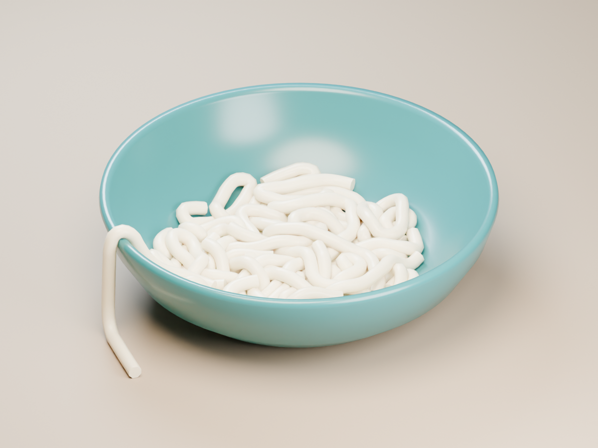

# Noodle Box for Blender

An installable Blender add-on for cooked noodle piles: gravity, stretch, XPBD bending, self-contact, cohesion, floor contact, and closed-mesh colliders. Includes six noodle types, a sidebar, and a one-click bowl demo. No external packages or network access required at runtime.

Requires **Blender 5.2+**. Tested locally with Blender 5.2.0 LTS.

## Install and start

1. Download [noodle_box-1.0.0.zip](dist/noodle_box-1.0.0.zip). Leave it zipped.
2. In Blender, open **Edit > Preferences > Get Extensions**, open the menu at the top right, and choose **Install from Disk**. Select the ZIP and enable **Noodle Box**. This is Blender's [local extension installation](https://docs.blender.org/manual/en/5.0/advanced/extensions/getting_started.html) workflow.
3. In a 3D Viewport, press **N** and open the **Noodles** tab. Choose a type and click **Add Noodles**, or click **Create Bowl Demo**.
4. Click **Frame Noodles**, then **Play**. After editing simulation settings, click **Restart** and replay from the start.

Installing/enabling the add-on does not create objects. Disabling it removes its controls and properties; existing Geometry Nodes objects remain usable. Re-enable it to restore the sidebar. Blender 5.2 or newer is required.

For development, `noodle_physics.py` remains a compatibility launcher. Keep it next to the `noodle_box/` folder; it is no longer a standalone single-file solver.

## Noodle types

Choose a type in the sidebar's **Noodle library**. **Apply Type** updates dimensions, flexibility, cohesion, material, and profile shape, then restarts the selected pile. Collider assignments and seed are preserved. Turn off **Use suggested strand count** to preserve your count too.

| Type | Length | Width | Profile | Suggested count |
| --- | ---: | ---: | --- | ---: |
| Udon | 24 cm | 10 mm | Round, pale, soft | 32 |
| Ramen | 22 cm | 5 mm | Round, golden, firmer | 24 |
| Spaghetti | 24 cm | 2.4 mm | Fine round pasta | 12 |
| Soba | 20 cm | 3.6 mm | Darker matte buckwheat style | 18 |
| Rice Ribbon | 18 cm | 10 mm | Flat, 20% thickness, flexible | 20 |
| Fettuccine | 24 cm | 7 mm | Flat, 28% thickness, golden | 20 |

These are editable, art-directed examples. Thin spaghetti and soba can require more than the 24-step runtime ceiling; the sidebar reports that limit, and their fall may be speed-clamped. Udon is the preferred live-preview starting point.

Ribbon profiles change the visible cross-section. Collision still uses a round envelope at the full width, so ribbon stacks can look more separated than their visible thickness implies. **Smooth Surface** rounds the displayed curve between simulation points without increasing the physics point count. It adds mesh cost and can slightly overshoot the sampled collision shape. Disable it to inspect the exact simulated polyline.

The existing Fast / Balanced / Quality shortcuts remain available separately. They change thickness and solver budget; they are not noodle type selections.

## Bowl demo

Click **Create Bowl Demo** to create a **separate scene**, leaving your current scene intact. It contains 24 Udon strands, a watertight ceramic bowl collider, a studio surface, three lights, a camera, and timeline markers. Play forward from frame 1. Use the scene selector to return to your previous scene.

Alternatively open [noodle_box_demo.blend](demo/noodle_box_demo.blend). It includes the playable setup and a **Finished Preview** scene containing a static frame-100 snapshot, so the finished example is visible without rebuilding a cache. The static preview is a mesh reference, not another live solver. A short guide is included in the file's Text Editor.



The sidebar provides Fast / Balanced / Quality presets, play/pause, cache reset, framing, a point-count estimate, scale warnings, and **Fit Step Budget**. Inputs are grouped into Noodles, Spawn, Solver, Colliders, and Sticky colliders in both the sidebar and the modifier.

For older generated piles, the sidebar shows **Update Solver**. Updating preserves input values and object transforms and restarts the simulation. Other piles sharing the old group remain untouched. **Add Another Pile** creates an independent solver. The development launcher also upgrades an existing pile when rerun.

## World scale

**One Blender unit is one metre.** New objects have identity transforms. The base solver uses the dimensions below; the noodle type library applies its own dimensions from the earlier table.

| Setting | Value |
| --- | ---: |
| Strand length | 0.25 m |
| Strand radius | 0.006 m (12 mm diameter) |
| Spawn disc diameter | 0.20 m |
| Spawn height | 0.12 m |
| Gravity | 9.81 m/s² |

Setup selects metric units with Unit Scale 1. This changes the scene's unit display, not the geometry of other objects. Gravity and the floor operate in the noodle object's local space: moving or rotating the object also moves or rotates its simulation frame. Leave object scale at 1 and change the length/radius inputs to change physical size.

These are thick preview noodles. Thin spaghetti needs many more points and substeps. Existing scenes made with the old 1000-unit defaults are preserved, **not automatically migrated**. Create a new pile at metre scale; scaling the old object down alone does not correct its physical timing.

## Real-time preview

Two changes reduce solver cost:

- **Adaptive Substeps** estimates the required steps from the fastest stored point velocity plus a full frame of gravity. A contact-stability minimum also limits gravity-induced movement per step to 5% of the radius. This prevents slow piles from dropping to too few steps and shaking. **Substeps** remains the maximum budget; too small a budget can still cause jitter. Disable adaptation for fixed-step comparisons.
- Empty collider branches bypass their distance-field sampling and position updates. Assigned object and collection colliders still use the full contact solver.

Damping is integrated over elapsed seconds, so changing timeline FPS no longer changes the amount of air drag over the same duration. Simulation playback uses **Play Every Frame**; skipping frames cannot substitute for solving them.

**Contact Damping** suppresses low-speed contact vibrations in all directions, including vertical wobble. Its strength is adjusted for elapsed time and its velocity threshold scales with radius and gravity. It does not freeze positions or affect free fall; moving colliders can still lift the pile. Start at 1; lower it if slow contact motion feels too damped. A dense 48-strand regression scene's RMS frame-to-frame shake dropped from 2.80 mm to 0.56 mm with the stability changes.

All presets now use metres. Quality presets change thickness as well as solver cost. Applying one preserves count, seed, collider assignments, and contact settings; it restores the preset's dimensions, gravity, step budget, adaptation, iterations, and surface resolution. Applying `default` restores those defaults even after a different preset.

| Preset | Diameter | Max substeps | Profile sides | Initial strands |
| --- | ---: | ---: | ---: | ---: |
| `default` | 12 mm | 14 | 6 | 48 |
| `quality` | 8 mm | 20 | 8 | 48 |
| `balanced` | 12 mm | 14 | 5 | 48 |
| `fast` | 18 mm | 10 | 4 | 32 |
| `metric` | 16 mm | 17 | 5 | 48 |
| `metric_fast` | 24 mm | 12 | 4 | 48 |

The last two keep the earlier metric examples: 0.5 m strands dropped from 0.35 m. Sidebar performance buttons preserve your strand count; initial counts above apply when creating a scene through the corresponding CLI preset. `PRESET` in `noodle_box/solver.py` controls development-launcher startup and defaults to `"balanced"`. The add-on's Add Noodles button uses the selected noodle type instead.

### Measurements

Measured on this workspace's Windows machine, Blender 5.2.0 LTS, no mesh colliders, 120 forward frames. The first five frames are excluded from timing summaries. Results include geometry evaluation, tube generation, and vertex inspection, but **exclude viewport drawing**. They are simulation throughput measurements, not guaranteed live viewport FPS.

| Preset | Strands | Mean ms/frame | p95 ms/frame | Headless frames/s |
| --- | ---: | ---: | ---: | ---: |
| Fast | 32 | 8.9 | 12.2 | 113.0 |
| Balanced | 48 | 21.5 | 25.2 | 46.5 |
| Quality | 48 | 32.3 | 34.7 | 31.0 |
| Balanced | 120 | 30.0 | 32.8 | 33.4 |

A 24 fps timeline has 41.7 ms per frame. These measurements include the contact-stability fix, which spends more substeps on slow frames than the earlier jitter-prone version. Complex colliders, multiple piles, small radii, higher iteration counts, and viewport effects consume additional time. Reduce strand count first when the frame budget is exceeded.

## Step budget and collision limits

Point spacing is derived from each strand's length and diameter. Do not replace it with arbitrary subdivisions: nearest-point self-contact depends on this spacing.

The displacement clamp approximately limits fall speed to:

```text
2 * radius * 0.85 * substeps * timeline_fps
```

Lowering the budget too far makes the fall slow down. **Fit Step Budget** uses radius, gravity, timeline FPS (including FPS Base), spawn height, and the longest possible strand to calculate a conservative full-height fall budget. The calculation rounds up. Adaptive stepping cannot exceed this budget.

Runtime limits are visible in the sliders: **24 substeps** and **12 iterations**. If the required budget exceeds 24, the sidebar warns rather than claiming the scene can run unclamped. Increase radius or lower the drop height. The estimate covers a fall from rest; externally driven fast colliders may need additional care.

Self-contact uses one nearest point per sample and is approximate. Dense stacks can interpenetrate; this is not continuous collision detection. Adaptive stepping also changes constraint convergence, so a final pile need not match a fixed-step bake exactly. Use fixed steps and higher quality for repeatable comparisons.

## Colliders

Assign a closed mesh to **Collider**, or closed meshes to **Collider Collection**. Add Solidify to an open bowl or plate. The local floor at Z = 0 remains active.

**Sticky Collider** takes another collection with its own grip. Collections are joined and voxelised once per evaluated frame. Animated/deforming colliders are supported, but fast motion can cross the distance field's narrow band between frames and tunnel. Collider Friction controls sideways damping; Collider Stickiness attracts nearby strands to the surface.

## Headless commands

Pass script arguments after Blender's `--`. Use `--python-exit-code 1` so Python errors fail automated runs:

```sh
blender --background --factory-startup --python-exit-code 1 --python noodle_physics.py -- --check
blender --background --factory-startup --python-exit-code 1 --python noodle_physics.py -- --bench balanced 48 120
blender --background --factory-startup --python-exit-code 1 --python noodle_physics.py -- --bench fast 32 120
blender --background --factory-startup --python-exit-code 1 --python noodle_physics.py -- --realtime balanced
```

`--bench [preset] [count] [frames]` defaults to `default 120 60` and reports mean, median, p95, evaluation time, and the timeline budget. Its 25%-of-spawn-height marker measures drop progress, **not physical rest**: a tall settled pile may never reach it. Wall time to that marker is the measured sum of frames, including startup.

`--check` checks falling, floor clearance, launch height, finite bounds, and sideways spread. Unknown arguments, extra arguments, invalid presets, and nonpositive counts/frames fail validation.

## Development and tests

Source layout:

- `noodle_box/solver.py`: Geometry Nodes solver, controls, and operators.
- `noodle_box/presets.py`: noodle type settings and materials.
- `noodle_box/demo.py`: procedural bowl and studio scene.
- `noodle_box/blender_manifest.toml`: Blender extension metadata.
- `tools/build_addon.py`: build the distributable ZIP with Python's standard library.
- `tools/build_demo.py`: generate the `.blend` and rendered preview inside Blender.

```sh
python tools/build_addon.py
blender --factory-startup --command extension validate dist/noodle_box-1.0.0.zip
blender --background --factory-startup --python-exit-code 1 --python tools/build_demo.py
```

`tools/test_install.py` exercises Blender's actual ZIP installer, enable/disable lifecycle, type creation, and demo creation. Run it in a dedicated background Blender with `BLENDER_USER_RESOURCES` set to a temporary test directory; it refuses to run without that isolation.

The test suite uses Blender's Python API. The standalone `bpy` wheel is tied to a Python version:

```sh
python3.13 -m venv .venv-test
# Activate the environment, then:
python -m pip install "bpy==5.2.1" pytest
python -m pytest tests/ -v
```

Alternatively, install pytest in Blender's Python environment and run:

```sh
blender --background --factory-startup --python-exit-code 1 --python-expr "import pytest; raise SystemExit(pytest.main(['tests', '-v']))"
```

Coverage includes the original velocity-clamp regressions, metric defaults, scale invariance, adaptive versus fixed-step free fall, FPS-independent damping, self-contact, all three collider sources, complete preset restoration, safe repeated setup, sidebar operators, strict CLI parsing, settled-pile jitter, moving-collider lift, and solver upgrades. Set `NOODLE_SCRIPT=<path>` to test another revision. Tests reset the Blender scene; run them in a dedicated background process.

## Troubleshooting

- **No motion or stale geometry:** Restart and play forward from the scene's start frame. Do not jump directly to an uncached frame.
- **Jitter with an older scene:** select the pile and click Update Solver. Keep Contact Damping at 1, use Fit Step Budget, then replay from the start. Restart alone cannot update an older node graph.
- **Tiny object after switching from the old scale:** select the new pile and use Frame Noodles.
- **Slow fall:** use Fit Step Budget and check the resulting warning. Do not lower gravity to disguise a performance problem.
- **Slow playback:** reduce strand count, choose Fast, lower Profile Faces, and check complex collider geometry.
- **Leaking collider:** check that the mesh is closed, has thickness, and moves slowly enough for its distance field.
- **Unexpected dimensions:** keep scene Unit Scale and object scale at 1. Rebuild old oversized scenes instead of scaling their carrier object.

Geometry Nodes panel grouping uses Blender's [node interface panels](https://docs.blender.org/api/main/bpy.types.NodeTreeInterfacePanel.html); simulation state follows Blender's [Simulation Nodes](https://docs.blender.org/manual/en/dev/physics/simulation_nodes.html) workflow.

Apache-2.0; see [LICENSE](LICENSE).
